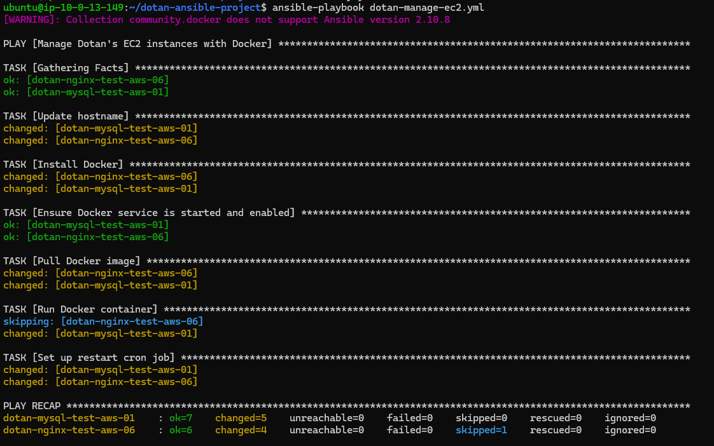

# Dotan's Submission for Ansible EC2 Management Workshop @NitzanimToTech

This project uses Ansible to manage EC2 instances on AWS.
## צילום מסך הרצה של הפלייבוק:


## שאלות ותשובות מבחן אנסיבל

1. Pros of using Ansible as opposed to an AMI template:

   תשובה:
   - שליטה מלאה וגמישות לשינויים שנרצה להוסיף לתמונה המוכנה הבסיסית
   - ניתן להעלות את הקוד ולגיטהאב ולעקוב אחרי שינויי גרסא

2. Cons of using Ansible as opposed to an AMI template:

   תשובה:
   - יכול להיות שחלק מהחבילות שרשומות בפלייבוק השתנו כמו חבילות מבוססות קוד פתוח ואז יהיו לנו בעיות בהרצה ושגיאות
   - יכול לקחת הרבה זמן במערכות גדולות

## פקודת הרצה

Run the playbook:
```
ansible-playbook -i inventory.yml dotan-manage-ec2.yml
```

## הערות:
- הפרויקט דורש סביבת Ansible מוגדרת נכונה על שרת ייעודי (למשל, EC2 instance)
- יש להגדיר AWS credentials תקפים על שרת ה-Ansible
- הפלייבוק יפעל רק על ה-EC2 instances המוגדרים ב-inventory.yml
- יש לוודא שה-instances המוגדרים ב-inventory קיימים ופעילים ב-AWS
- התצורה הנוכחית מותאמת ספציפית ל-instances שהוגדרו במסגרת הפרויקט ועשויה לדרוש התאמות לסביבות אחרות